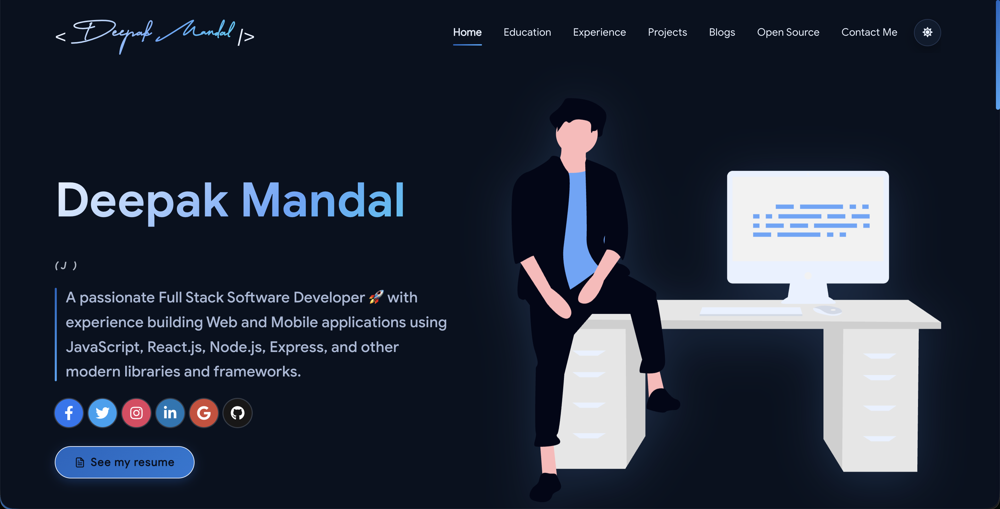
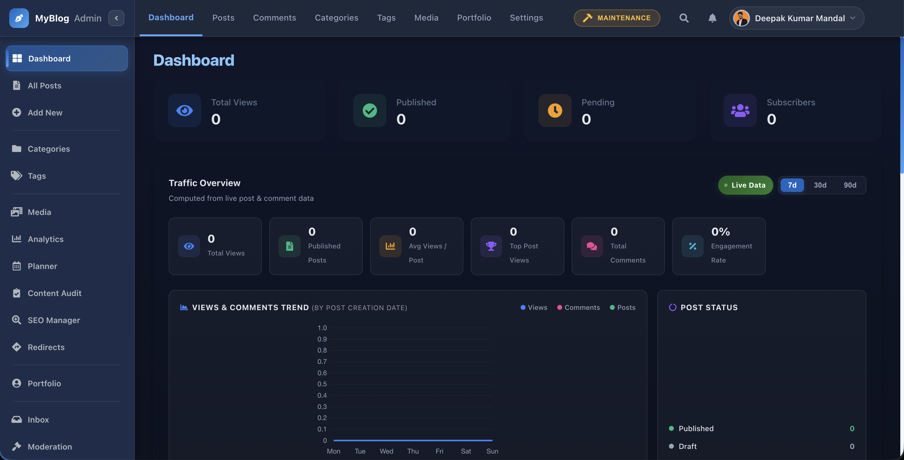

# 🚀 Deep Portfolio & Admin CMS

<p align="center">
  
  
  
  
  
</p>

A high-end, premium portfolio template featuring a fully-integrated **Admin Dashboard CMS**. This project is designed for software developers who want a beautiful, glassmorphic portfolio combined with the power of a professional content management system.

**[🔗 View Live Demo](https://deepakmandal.dev)** • **[🚀 Setup Wizard](#setup-wizard--initial-configuration)** • **[🛠️ Tech Stack](#tech-stack)**

---

## 📸 Visual Tour

| **Premium Portfolio** | **Admin Dashboard** |
| :---: | :---: |
|  |  |
| *Glassmorphic UI & Animations* | *Powerful Content Management* |

---

## ✨ Key Features

### 💎 Premium Portfolio UI
- **Modern Aesthetics**: Sleek glassmorphic design with smooth transitions and cinematic animations.
- **Dynamic Content**: Sections for Projects, Experience, Education, Certifications, and Open Source contributions.
- **GitHub Integration**: Automatically fetches your real-time GitHub contributions, PRs, and pinned projects.
- **Responsive & Accessible**: Fully optimized for mobile, tablet, and desktop with dark/light mode support.

### 🔐 Admin Panel (CMS)
- **Content Management**: Create, edit, and delete blog posts with a rich-text editor.
- **Media Library**: Manage images and assets directly from the dashboard.
- **Comment Moderation**: Approve or remove comments on your posts.
- **SEO & Analytics**: Built-in tools to track performance and optimize your presence.
- **Maintenance Mode**: One-click "Under Maintenance" toggle with a smart bypass for administrators.
- **Enterprise-Grade Security**: Supports **Two-Factor Authentication (2FA)** and password recovery.

---

## 🛠️ Tech Stack

- **Frontend**: [React](https://reactjs.org/), [Vite](https://vitejs.dev/), [Styled Components](https://styled-components.com/)
- **Backend**: PHP 8.x / MySQL (Professional API Layer)
- **Deployment**: Node.js FTP Deployment Pipeline
- **Animations**: CSS3 Keyframes & Framer Motion

---

## 📂 Project Structure

```text
├── src/                # Frontend Source Code
│   ├── components/     # Reusable UI Components
│   ├── containers/     # Page Layouts & Logic
│   ├── pages/          # Individual Pages (Home, Admin, etc.)
│   ├── shared/         # Data Files & Helpers
│   └── portfolio.js    # YOUR PRIMARY CONFIG FILE
├── backend/            # PHP API & Database Scripts
├── scripts/            # Deployment & Maintenance Scripts
├── public/             # Static Assets & Icons
├── .env.example        # Environment Template
└── git_data_fetcher.js # GitHub Stats Automation
```

---

## 🧙‍♂️ Setup Wizard & Initial Configuration

This project includes a built-in **Setup Wizard** to help you get your database and admin panel running in minutes.

### 1. Database Preparation
- Create a new **MySQL Database** on your hosting server (e.g., via cPanel or Hostinger Dashboard).
- Note down your **Database Name**, **Username**, and **Password**.

### 2. Running the Installer
1.  Deploy the backend files to your server.
2.  Navigate to your site at `yourdomain.com/#/install`.
3.  The Setup Wizard will guide you through:
    - **Environment Check**: Verifying server compatibility.
    - **Database Connection**: Linking your site to your MySQL database.
    - **Admin Setup**: Creating your primary administrative account (Username & Password).

### 3. Post-Installation
- Once finished, the installer will automatically generate a `config.php` file on your server and lock itself for security.
- You can now log in to the **Admin Dashboard** at `yourdomain.com/#/admin/login`.

---

## 🚀 Getting Started

### 1. Prerequisites
- **Node.js** (v16+)
- **NPM** or **Yarn**

### 2. Local Installation
```bash
# Clone the repository
git clone https://github.com/dmandal1/my-portfolio.git

# Install dependencies
npm install

# Start the development server
npm start
```

### 3. Configuration

#### Environment Variables
Create a `.env` file in the root directory (refer to `.env.example`):

| Variable | Description | Example |
| :--- | :--- | :--- |
| `VITE_API_URL` | Endpoint for the PHP API layer | `/api` |
| `VITE_SITE_URL` | Your public portfolio URL | `https://deepakmandal.dev` |
| `FTP_HOST` | Hostinger/Server FTP address | `ftp.yourdomain.com` |
| `FTP_USER` | FTP account username | `u123456789` |
| `FTP_PASSWORD` | FTP account password | `********` |
| `FTP_REMOTE_PATH`| Remote target directory | `/public_html` |
| `VITE_EMAILJS_*` | Optional EmailJS credentials | `service_xxx` |

#### GitHub Data Fetching
Update `git_data_fetcher.mjs` with your GitHub username and run:
```bash
node git_data_fetcher.mjs
```
*This will generate `src/shared/githubData.json` used by the portfolio.*
---

## 📤 Deployment

```bash
# Deploy only the frontend
npm run deploy:frontend

# Deploy everything
npm run deploy
```

---

## ⚙️ Maintenance Mode
You can enable maintenance mode via the **Admin Settings**. 
- **Visitor View**: Sees a premium maintenance countdown and status bar.
- **Admin Bypass**: Admins can always access `/admin`, ensuring you are never locked out.

---

## 🔐 Security & Identity

This project prioritizes administrative security with professional-grade features:
- **Two-Factor Authentication (2FA)**: Secure your login with email-based OTP verification.
- **Identity Verification Emails**: Premium, branded HTML email templates for security alerts.
- **Secure Sessions**: JWT-based authentication for all administrative API calls.
- **Activity Logging**: Track login attempts and security events directly on your server.

---

## 🤝 Contributing

Contributions are what make the open source community such an amazing place to learn, inspire, and create. Any contributions you make are **greatly appreciated**.

1. Fork the Project
2. Create your Feature Branch (`git checkout -b feature/AmazingFeature`)
3. Commit your Changes (`git commit -m 'Add some AmazingFeature'`)
4. Push to the Branch (`git push origin feature/AmazingFeature`)
5. Open a Pull Request

---

## ❤️ Credits & Inspiration

This project is inspired by and draws core concepts from **[masterPortfolio](https://github.com/ashutosh1919/masterPortfolio)**. It extends those ideas with a premium glassmorphic UI refresh, integrated PHP/MySQL backend CMS, and enterprise security features.

## 📄 License
This project is licensed under the MIT License.

---
<p align="center">Made with ❤️ by <a href="https://deepakmandal.dev">Deepak Mandal</a></p>
